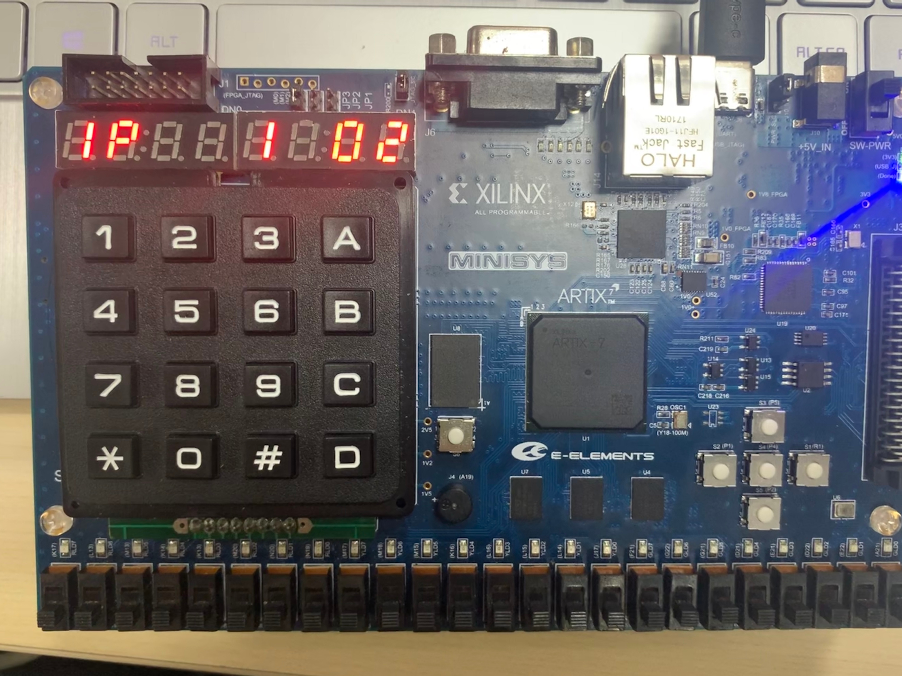
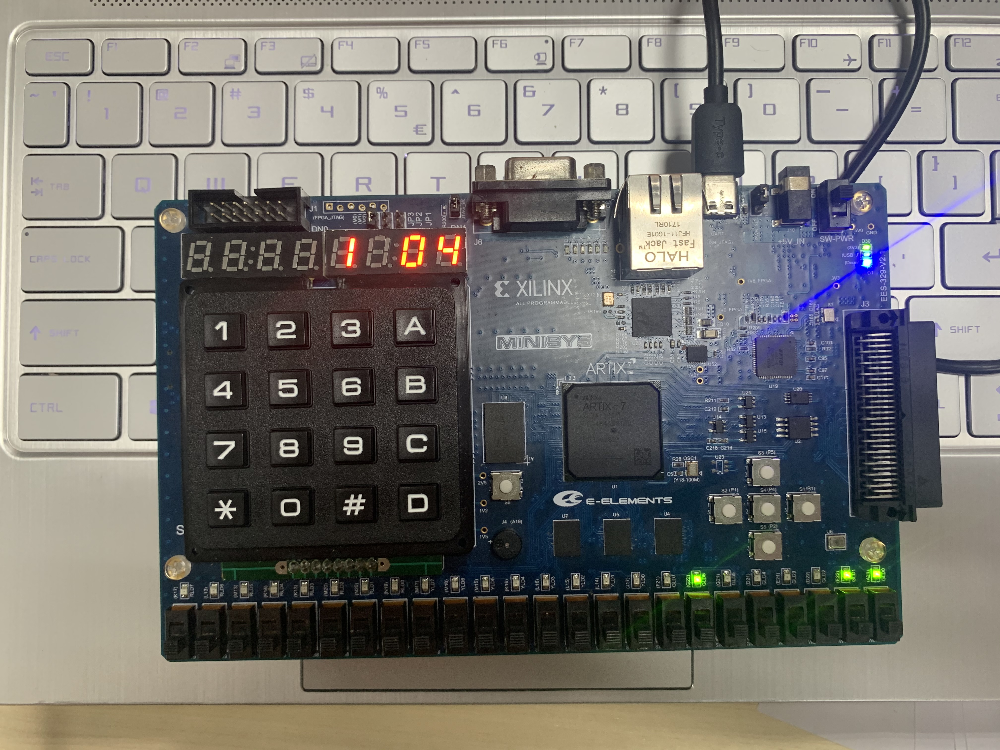

# 目录

[TOC]

# 开发计划及执行记录

## a) 题目要求
[task2.pdf](task2.pdf)

## b) 任务划分
  
   江川(11811712)：总体设计整合，设置模块，抢答模块，结果显示模块，输入处理模块，单独的测试模块
   
   张湲(11811702)：审视玩家分数模块，音乐播放模块，Report，仿真文件
   
   鲁瑞敏(11810208)：审视题目给分模块，音乐播放模块，Report，仿真文件

## c) 执行记录
    
   2019.12.06：确定选题、进行分工
   
   2019.12.13：模块整合、检验成果
   
   2019.12.20：完成报告

# 设计

## a) 项目描述

本次项目我们使用 verilog 语言进行开发，利用 Minisys 板子实现抢答器

抢答器共有五个视图，除结果显示视图外，每个视图下，七段数码管左边会显示当前视图的标志

### Set

设置视图的标志为 `S`

抢答器置于初始状态时，会默认进入`S`状态，通过 `*`来切换`S`与`C`状态

在抢答过程中，按下`*`会重新进入`S`模式，原设置不变，抢答器的`C`模式会重置

设置视图有如下状态，在状态中按 `*` 返回

- 1，设置参与人数（2-4，默认值为2）
- 2，设置答题题数（0-9，默认值为5）
- 3，设置抢答倒计时时间（0-99，默认值为10）
- 4，设置胜利分数（0-99，默认值为5）
- 5，设置答对一题的得分（0-10，默认值 1）
- 6，设置答错一题的扣分（0-10，默认值 1）

主持人可以右边的左右按键来切换状态，可以通过右边的上下按键以及左边小键盘来调整每个状态的数值

### Competition

抢答视图的标志为 `C`

抢答视图有 <题数> 个模式，一开始的模式为 0

- `C<题数> A`处于就绪状态，主持人可以拨开关 `#`进入下一个模式，并将状态置为 `C<题数>b` ，同时会有蜂鸣器提醒，
- `C<题数> b`处于抢答状态，最右侧数码管显示倒计时，主持人可以按下 1，2，3，4 按钮来确定抢到题目的选手，并将状态置为 `C<题数>C`，显示选手的编号和当前分数
（若倒计时结束没有选手抢答，则显示0并进入`C<题数> C`模式，表示无人抢答）
- `C<题数> C`处于锁定状态，主持人可以按 A，B，0 评分，A为答对，B为答错，0为不计分，然后显示更新后的分数，同进进入 `C<题数+1> A` 模式

### Inspect Player

是审视选手视图，标志为`IP`

抢答器处在`C`状态时，可以按按钮`C`，进入审视选手模式，审视选手模式可以选手的编号和分数，按`C`返回

主持人可以右边的左右按键来切换选手

### Inspect Question

是审视问题得分视图，标志为`Iq`

抢答器处在`C`状态时，可以按按钮 `D`，进入审视得分模式，审视得分模式按题目编号可以显示该题得分状态A、B、0，按 `D` 返回

主持人可以右边的左右按键来切换题目

### Win

答题过程中，如果有选手达到获胜分数，会提前进入结果显示模式

如果题目答完，没有玩家达到获胜分数，则默认分数最高且编号靠前的选手为获胜者并进入结果显示模式

结果显示模式会滚动显示各组的编号、分数，滚动完后显示胜利组的组号及分数

滚动显示时，最右侧的led灯会根据节拍改变，蜂鸣器会播放一段音乐

## b) 系统结构图


## c) 子模块

### top_module

是根模块，会利用各个子模块实例化 view 模块、control 模块，实现抢答器

```verilog
module top_module(
    input clk,
    input rst,
    input[23:0] sw,
    input[4:0] bt,
    input[3:0] row,
    output[3:0] col,
    output reg[7:0] seg_out,
    output reg[7:0] seg_en,
    output reg[23:0] led,
    output reg buzzer
);

endmodule
```

### setting_view

是设置视图，通过该模块输入玩家数量、问题数量、抢答时间、胜利时的分数、答对一题的得分，答错一题的扣分
并将这些信息显示在七段数码管上

```verilog
module setting_view(
    input clk,
    input rst,
    input [2:0] view,
    input [2:0] state,

    input [2:0] player_count,
    input [3:0] question_count,
    input [6:0] answer_time,
    input [6:0] win_socre,
    input [3:0] success_score,
    input [3:0] fail_score,

    output[7:0] seg_out,
    output[7:0] seg_en,
    output reg[23:0] led,
    output reg buzzer
);

endmodule
```

### competition_view

此模块用于显示比赛时的各种信息，如抢答器的模式信息、当前答题人的信息、题号、抢答倒计时等.并且，此模块还控制蜂鸣器在题被抢到时的响应

```verilog
module competition_view(
    input clk,
    input rst,
    input [2:0] view,

    input[3:0]  play_count,
    input[2:0]  state,

    input[17:0] time_remain,
    input[6:0]  player1_score,
    input[6:0]  player2_score,
    input[6:0]  player3_score,
    input[6:0]  player4_score,
    input[17:0] player1_list,
    input[17:0] player2_list,
    input[17:0] player3_list,
    input[17:0] player4_list,
    input[2:0]  select_player,
    input[2:0]  winner,

    output[7:0] seg_out,
    output[7:0] seg_en,
    output[23:0] led,
    output buzzer
);

endmodule
```

### inspect_player_view

是玩家视图，通过该模块输入玩家数及玩家的分数，可以在七段数码管上分别显示当前每个玩家已获得的分数

```verilog
module inspect_player_view(
    input clk,
    input rst,
    input [2:0] view,

    input[4:0] bt_edge,

    input[2:0] player_count,
    input[6:0] player1_score,
    input[6:0] player2_score,
    input[6:0] player3_score,
    input[6:0] player4_score,

    output[7:0] seg_out,
    output[7:0] seg_en,
    output reg[23:0] led,
    output reg buzzer
);

endmodule
```

### inspect_question_view

是问题视图，通过该模块输入玩家数量及每个玩家的回答情况，将每道题的得分情况展示在七段数码管上
`player_list`是每个玩家的分数列表，`player_list[n+1,n]`为第该玩家在第n-1道题的得分情况
其中`player_list[n+1,n]`位中`00`、`01`、`10`、`11`分别表示玩家未抢到、玩家抢到且回答正确、玩家抢到但回答错误、玩家抢到但不得分

```verilog
module inspect_question_view(
    input clk,
    input rst,
    input [2:0] view,

    input[4:0] bt_edge,

    input[3:0]  play_count,
    input[17:0] player1_list,
    input[17:0] player2_list,
    input[17:0] player3_list,
    input[17:0] player4_list,

    output[7:0] seg_out,
    output[7:0] seg_en,
    output reg[23:0] led,
    output reg buzzer
);

endmodule
```

### win_view

是某个参赛者获胜的的视图，通过该模块输入玩家的分数与胜利者的编号，该模块会在七段数码管上循环展示每个参赛者的分数，
最终会获胜者的编号和分数会停留在七段数码管的右侧，同时通过`music_player`播放音乐

```verilog
module win_view(
    input clk,
    input rst,
    input [2:0] view,

    input[2:0] player_count,
    input[6:0] player1_score,
    input[6:0] player2_score,
    input[6:0] player3_score,
    input[6:0] player4_score,
    input[2:0] winner,

    output[7:0] seg_out,
    output[7:0] seg_en,
    output[23:0] led,
    output buzzer
);

endmodule
```

### setting_control

可以通过小键盘及右侧按钮获得设置信息，并将设置信息传给`setting_view`

```verilog
module setting_control(
    input clk,
    input rst,
    input[23:0] sw_press,
    input[23:0] sw_edge,
    input[4:0] bt_press,
    input[4:0] bt_edge,
    input[15:0] key_press,
    input[15:0] key_edge,

    input[2:0] view,

    output reg[2:0] player_count,
    output reg[3:0] question_count,
    output reg[6:0] answer_time,
    output reg[6:0] win_score,
    output reg[3:0] success_score,
    output reg[3:0] fail_score,
    output reg[2:0] state
);

endmodule
```

### competition_control

比赛控制模块是最重要的模块之一.通过该模块控制抢答倒计时，让主持人决定由哪位选手答题以及该题得得分情况，
计算和记录各位选手的得分情况，最终输出胜利者,而且此模块还会将比赛中的相关信息输出到其他有需要的子模块以供利用

```verilog
module competition_control(
    input clk,
    input rst,
    input[23:0] sw_press,
    input[23:0] sw_edge,
    input[4:0] bt_press,
    input[4:0] bt_edge,
    input[15:0] key_press,
    input[15:0] key_edge,

    input[2:0] view,

    input [2:0] player_count,
    input [3:0] question_count,
    input [6:0] answer_time,
    input [6:0] win_socre,
    input [3:0] success_score,
    input [3:0] fail_score,

    output reg[3:0]  play_count,
    output reg[2:0]  state,

    output reg[17:0] time_remain,
    output reg[6:0]  player1_score,
    output reg[6:0]  player2_score,
    output reg[6:0]  player3_score,
    output reg[6:0]  player4_score,
    output reg[17:0] player1_list,
    output reg[17:0] player2_list,
    output reg[17:0] player3_list,
    output reg[17:0] player4_list,
    output reg[2:0]  select_player,
    output reg[2:0]  winner
);

endmodule
```

### input_process

可以将小键盘及右边按钮进行防抖动处理，生成edge信号与press信号

```verilog
module input_process(
    input clk, rst,
    input[23:0] sw,
    input[4:0] bt,
    input[3:0] row,
    output[3:0] col,
    output[23:0] sw_press,
    output[23:0] sw_edge,
    output[4:0] bt_press,
    output[4:0] bt_edge,
    output[15:0] key_press,
    output[15:0] key_edge
);

endmodule
```

### key_mapping

是将小键盘上的坐标信息转化为与其对应的数字信息

```verilog
module key_mapping(
    input[15:0] key_in,
    output[15:0] key_out
);

endmodule
```

### key_scanner

是扫描小键盘的模块，将按下按键的信号转化为坐标信息

```verilog
module key_scanner(
    input clk, rst,
    input [3:0] row,
    output reg [3:0] col,
    output [15:0] keys
);

endmodule
```

### counter

是一个常规的计数器模块

```verilog
module counter(
    input clk,
    input rst,
    input[15:0] period,
    output clk_counter
);

endmodule
```

### music_player

是音乐播放模块，会按照曲谱，用蜂鸣器播放音乐，同时右侧的led会随着节拍变化

```verilog
module music_player(
    input clk,
    input rst,
    output[23:0] led,
    output buzzer
);

endmodule
```

### seg_tube

输入信号后，该模块可选择数码管在不同的位置变亮

```verilog
module seg_tube(
    input clk,
    input[7:0] i0, i1, i2, i3, i4, i5, i6, i7,
    output reg[7:0] seg, seg_en
);

endmodule

```

### Button Jitter Remover

此工程需要大量用到按键，所以按键防抖动很关键.为了确认按键确实被按下了，我们
使用了一个计数器来计数2*10^5个时钟周期，如果按键的状态在这么多时钟周期内保持不变，那么我们认为这是一次有效的按压，
根据此来改变but_press的状态

```verilog
module button_jitter(
    input clk,
    input but_in,
    output but_out
);

endmodule
```

### button_edge

在此模块中，通过实例化button_jitter，可以输出but_press的状态,
同时根据按下按键的操作，产生持续一个时钟周期高电平的but_edge信号
```verilog
module button_edge(
    input clk,
    input but_in,
    output but_press,
    output but_edge
);

endmodule
```

### edge_gen

此模块在按键按压时会产生一个时钟周期的高电平

```verilog
module edge_gen(
    input clk,
    input in,
    output out_edge
);

endmodule
```

### buzzer_player

此模块时蜂鸣器的基本控制组件，用于接受需要播放的频率信息，从而将其播放出来，形成一定的声调

```verilog
module buzzer_player(
    input clk,
    input[11:0] hz_next,
    output reg buzzer
);

endmodule
```

### alert_player

此模块用于产生抢到题时的警报声音

```verilog
module alert_player(
    input clk, rst, set,
    output buzzer
);

endmodule
```

### clk_division

常规的分频器

```verilog
module clk_div(
    input clk,
    input rst,
    output reg clock
);

endmodule
```

### bcd_seg

控制七段数码管显示需要显示的信息

```verilog
module bcd_seg(
    input[3:0] num,
    output reg[7:0] seg_out
);

endmodule
```

## d) 约束文件

```plain
set_property PACKAGE_PIN K17 [get_ports {led[23]}]
set_property PACKAGE_PIN L13 [get_ports {led[22]}]
set_property PACKAGE_PIN M13 [get_ports {led[21]}]
set_property PACKAGE_PIN K14 [get_ports {led[20]}]
set_property PACKAGE_PIN K13 [get_ports {led[19]}]
set_property PACKAGE_PIN M20 [get_ports {led[18]}]
set_property PACKAGE_PIN N20 [get_ports {led[17]}]
set_property PACKAGE_PIN N19 [get_ports {led[16]}]
set_property PACKAGE_PIN M17 [get_ports {led[15]}]
set_property PACKAGE_PIN M16 [get_ports {led[14]}]
set_property PACKAGE_PIN M15 [get_ports {led[13]}]
set_property PACKAGE_PIN K16 [get_ports {led[12]}]
set_property PACKAGE_PIN L16 [get_ports {led[11]}]
set_property PACKAGE_PIN L15 [get_ports {led[10]}]
set_property PACKAGE_PIN L14 [get_ports {led[9]}]
set_property PACKAGE_PIN J17 [get_ports {led[8]}]
set_property PACKAGE_PIN F21 [get_ports {led[7]}]
set_property PACKAGE_PIN G22 [get_ports {led[6]}]
set_property PACKAGE_PIN G21 [get_ports {led[5]}]
set_property PACKAGE_PIN D21 [get_ports {led[4]}]
set_property PACKAGE_PIN E21 [get_ports {led[3]}]
set_property PACKAGE_PIN D22 [get_ports {led[2]}]
set_property PACKAGE_PIN E22 [get_ports {led[1]}]
set_property PACKAGE_PIN A21 [get_ports {led[0]}]
set_property IOSTANDARD LVCMOS33 [get_ports {led[23]}]
set_property IOSTANDARD LVCMOS33 [get_ports {led[22]}]
set_property IOSTANDARD LVCMOS33 [get_ports {led[21]}]
set_property IOSTANDARD LVCMOS33 [get_ports {led[20]}]
set_property IOSTANDARD LVCMOS33 [get_ports {led[19]}]
set_property IOSTANDARD LVCMOS33 [get_ports {led[18]}]
set_property IOSTANDARD LVCMOS33 [get_ports {led[17]}]
set_property IOSTANDARD LVCMOS33 [get_ports {led[16]}]
set_property IOSTANDARD LVCMOS33 [get_ports {led[15]}]
set_property IOSTANDARD LVCMOS33 [get_ports {led[14]}]
set_property IOSTANDARD LVCMOS33 [get_ports {led[13]}]
set_property IOSTANDARD LVCMOS33 [get_ports {led[12]}]
set_property IOSTANDARD LVCMOS33 [get_ports {led[11]}]
set_property IOSTANDARD LVCMOS33 [get_ports {led[10]}]
set_property IOSTANDARD LVCMOS33 [get_ports {led[9]}]
set_property IOSTANDARD LVCMOS33 [get_ports {led[8]}]
set_property IOSTANDARD LVCMOS33 [get_ports {led[7]}]
set_property IOSTANDARD LVCMOS33 [get_ports {led[6]}]
set_property IOSTANDARD LVCMOS33 [get_ports {led[5]}]
set_property IOSTANDARD LVCMOS33 [get_ports {led[4]}]
set_property IOSTANDARD LVCMOS33 [get_ports {led[3]}]
set_property IOSTANDARD LVCMOS33 [get_ports {led[2]}]
set_property IOSTANDARD LVCMOS33 [get_ports {led[1]}]
set_property IOSTANDARD LVCMOS33 [get_ports {led[0]}]
set_property PACKAGE_PIN Y9 [get_ports {sw[23]}]
set_property PACKAGE_PIN W9 [get_ports {sw[22]}]
set_property PACKAGE_PIN Y7 [get_ports {sw[21]}]
set_property PACKAGE_PIN Y8 [get_ports {sw[20]}]
set_property PACKAGE_PIN AB8 [get_ports {sw[19]}]
set_property PACKAGE_PIN AA8 [get_ports {sw[18]}]
set_property PACKAGE_PIN V8 [get_ports {sw[17]}]
set_property PACKAGE_PIN V9 [get_ports {sw[16]}]
set_property PACKAGE_PIN AB6 [get_ports {sw[15]}]
set_property PACKAGE_PIN AB7 [get_ports {sw[14]}]
set_property PACKAGE_PIN V7 [get_ports {sw[13]}]
set_property PACKAGE_PIN AA6 [get_ports {sw[12]}]
set_property PACKAGE_PIN Y6 [get_ports {sw[11]}]
set_property PACKAGE_PIN T6 [get_ports {sw[10]}]
set_property PACKAGE_PIN R6 [get_ports {sw[9]}]
set_property PACKAGE_PIN V5 [get_ports {sw[8]}]
set_property PACKAGE_PIN U6 [get_ports {sw[7]}]
set_property PACKAGE_PIN W5 [get_ports {sw[6]}]
set_property PACKAGE_PIN W6 [get_ports {sw[5]}]
set_property PACKAGE_PIN U5 [get_ports {sw[4]}]
set_property PACKAGE_PIN T5 [get_ports {sw[3]}]
set_property PACKAGE_PIN T4 [get_ports {sw[2]}]
set_property PACKAGE_PIN R4 [get_ports {sw[1]}]
set_property PACKAGE_PIN W4 [get_ports {sw[0]}]
set_property IOSTANDARD LVCMOS33 [get_ports {sw[23]}]
set_property IOSTANDARD LVCMOS33 [get_ports {sw[22]}]
set_property IOSTANDARD LVCMOS33 [get_ports {sw[21]}]
set_property IOSTANDARD LVCMOS33 [get_ports {sw[20]}]
set_property IOSTANDARD LVCMOS33 [get_ports {sw[19]}]
set_property IOSTANDARD LVCMOS33 [get_ports {sw[18]}]
set_property IOSTANDARD LVCMOS33 [get_ports {sw[17]}]
set_property IOSTANDARD LVCMOS33 [get_ports {sw[16]}]
set_property IOSTANDARD LVCMOS33 [get_ports {sw[15]}]
set_property IOSTANDARD LVCMOS33 [get_ports {sw[14]}]
set_property IOSTANDARD LVCMOS33 [get_ports {sw[13]}]
set_property IOSTANDARD LVCMOS33 [get_ports {sw[12]}]
set_property IOSTANDARD LVCMOS33 [get_ports {sw[11]}]
set_property IOSTANDARD LVCMOS33 [get_ports {sw[10]}]
set_property IOSTANDARD LVCMOS33 [get_ports {sw[9]}]
set_property IOSTANDARD LVCMOS33 [get_ports {sw[8]}]
set_property IOSTANDARD LVCMOS33 [get_ports {sw[7]}]
set_property IOSTANDARD LVCMOS33 [get_ports {sw[6]}]
set_property IOSTANDARD LVCMOS33 [get_ports {sw[5]}]
set_property IOSTANDARD LVCMOS33 [get_ports {sw[4]}]
set_property IOSTANDARD LVCMOS33 [get_ports {sw[3]}]
set_property IOSTANDARD LVCMOS33 [get_ports {sw[2]}]
set_property IOSTANDARD LVCMOS33 [get_ports {sw[1]}]
set_property IOSTANDARD LVCMOS33 [get_ports {sw[0]}]

set_property PACKAGE_PIN Y18 [get_ports {clk}]
set_property IOSTANDARD LVCMOS33 [get_ports {clk}]

set_property PACKAGE_PIN P20 [get_ports {rst}]
set_property IOSTANDARD LVCMOS33 [get_ports {rst}]

set_property PACKAGE_PIN P2 [get_ports {bt[4]}]
set_property PACKAGE_PIN P4 [get_ports {bt[3]}]
set_property PACKAGE_PIN P5 [get_ports {bt[2]}]
set_property PACKAGE_PIN P1 [get_ports {bt[1]}]
set_property PACKAGE_PIN R1 [get_ports {bt[0]}]
set_property IOSTANDARD LVCMOS15 [get_ports {bt[4]}]
set_property IOSTANDARD LVCMOS15 [get_ports {bt[3]}]
set_property IOSTANDARD LVCMOS15 [get_ports {bt[2]}]
set_property IOSTANDARD LVCMOS15 [get_ports {bt[1]}]
set_property IOSTANDARD LVCMOS15 [get_ports {bt[0]}]

set_property IOSTANDARD LVCMOS33 [get_ports {seg_en[0]}]
set_property IOSTANDARD LVCMOS33 [get_ports {seg_en[1]}]
set_property IOSTANDARD LVCMOS33 [get_ports {seg_en[2]}]
set_property IOSTANDARD LVCMOS33 [get_ports {seg_en[3]}]
set_property IOSTANDARD LVCMOS33 [get_ports {seg_en[4]}]
set_property IOSTANDARD LVCMOS33 [get_ports {seg_en[5]}]
set_property IOSTANDARD LVCMOS33 [get_ports {seg_en[6]}]
set_property IOSTANDARD LVCMOS33 [get_ports {seg_en[7]}]
set_property IOSTANDARD LVCMOS33 [get_ports {seg_out[0]}]
set_property IOSTANDARD LVCMOS33 [get_ports {seg_out[1]}]
set_property IOSTANDARD LVCMOS33 [get_ports {seg_out[2]}]
set_property IOSTANDARD LVCMOS33 [get_ports {seg_out[3]}]
set_property IOSTANDARD LVCMOS33 [get_ports {seg_out[4]}]
set_property IOSTANDARD LVCMOS33 [get_ports {seg_out[5]}]
set_property IOSTANDARD LVCMOS33 [get_ports {seg_out[6]}]
set_property IOSTANDARD LVCMOS33 [get_ports {seg_out[7]}]
set_property PACKAGE_PIN A18 [get_ports {seg_en[7]}]
set_property PACKAGE_PIN A20 [get_ports {seg_en[6]}]
set_property PACKAGE_PIN B20 [get_ports {seg_en[5]}]
set_property PACKAGE_PIN E18 [get_ports {seg_en[4]}]
set_property PACKAGE_PIN F18 [get_ports {seg_en[3]}]
set_property PACKAGE_PIN D19 [get_ports {seg_en[2]}]
set_property PACKAGE_PIN E19 [get_ports {seg_en[1]}]
set_property PACKAGE_PIN C19 [get_ports {seg_en[0]}]
set_property PACKAGE_PIN E13 [get_ports {seg_out[7]}]
set_property PACKAGE_PIN C15 [get_ports {seg_out[6]}]
set_property PACKAGE_PIN C14 [get_ports {seg_out[5]}]
set_property PACKAGE_PIN E17 [get_ports {seg_out[4]}]
set_property PACKAGE_PIN F16 [get_ports {seg_out[3]}]
set_property PACKAGE_PIN F14 [get_ports {seg_out[2]}]
set_property PACKAGE_PIN F13 [get_ports {seg_out[1]}]
set_property PACKAGE_PIN F15 [get_ports {seg_out[0]}]

set_property PACKAGE_PIN A19 [get_ports {buzzer}]
set_property IOSTANDARD LVCMOS33 [get_ports {buzzer}]

set_property PACKAGE_PIN K4 [get_ports {row[3]}]
set_property PACKAGE_PIN J4 [get_ports {row[2]}]
set_property PACKAGE_PIN L3 [get_ports {row[1]}]
set_property PACKAGE_PIN K3 [get_ports {row[0]}]
set_property PACKAGE_PIN M2 [get_ports {col[3]}]
set_property PACKAGE_PIN K6 [get_ports {col[2]}]
set_property PACKAGE_PIN J6 [get_ports {col[1]}]
set_property PACKAGE_PIN L5 [get_ports {col[0]}]
set_property IOSTANDARD LVCMOS15 [get_ports {row[0]}]
set_property IOSTANDARD LVCMOS15 [get_ports {row[1]}]
set_property IOSTANDARD LVCMOS15 [get_ports {row[2]}]
set_property IOSTANDARD LVCMOS15 [get_ports {row[3]}]
set_property IOSTANDARD LVCMOS15 [get_ports {col[0]}]
set_property IOSTANDARD LVCMOS15 [get_ports {col[1]}]
set_property IOSTANDARD LVCMOS15 [get_ports {col[2]}]
set_property IOSTANDARD LVCMOS15 [get_ports {col[3]}]

```

# 子模块测试

## clk_div

clk_div将100mhz的时钟周期缩小1000倍

### Testbench
```verilog
module simForClk_div( );
reg clk,rst;
wire clock_div;

clk_div clk_div(clk,rst,clock_div);

    initial 
        fork
        clk<=0;rst<=1;
        # 10 rst<=0;
    forever
    #5 clk=~clk;
    join

endmodule
```

### 子模块的仿真波形


## edge_gen

生成一个时钟周期的高电平

### Testbench

```verilog
module simEdge_gen( ); reg clk,in;
wire out;

clk_div clk_div(clk,in,out);

//initial #100000 $finish; 
initial fork
    clk<=0;in<=0;
    forever
        #5 clk=~clk; 
    forever
    #10 in=~in; 
join

endmodule

```

### 子模块的仿真波形


# 总结

## a) 遇到的问题及解决方案

### 数字小键盘


4 × 4 键盘通过 4 根行选线和 4 根列选线连接到主芯片，其采用行列扫描的原理与主芯
片交换数据，图中显示了 4 × 4 键盘的原理图

问题：主芯片接受的是按键的“坐标”，而不是其所对应的键值

解决办法：要想获得需要的键值，需要在程序中对行、列信号的每一种组合方式进行翻译

### 按键防抖动

问题：在按下按钮时，短时间内可能发生低电平与高电平之间的跳变

解决办法：构建一个防抖动的模块，当电平一段时间内不再变化时，才输出更改过的电平

### edge边缘生成

问题：当按下按键时，高电平持续了多个时钟周期，可能导致输入发生意外的变化

解决方法：生成只持续一个时钟周期的高电平，并与防抖动配合使用

## b) 当前系统的特色以及优化方向

### 当前系统的特色
- 1.进入设置模式后可以设置参与者人数（2-4）
- 2.每道题抢答正确得分或错误扣分分值可以调节
- 3.可以查验每一题的得分情况（正确与否以及由谁回答）以及每个选手的总分情况
- 4.可以设置抢答倒计时
- 5.能够发挥数字键盘的优势 
- 6.在比赛结束时有一段音乐

### 优化方向

- 1.播放的音乐可以用户自定义
- 2.可以给用户更大的游戏规则选择权，如答对者连答

# Minisys测试结果

## Setting_view


## Competition_view


## inspect_player_view




## inspect_question_view


## win_view


